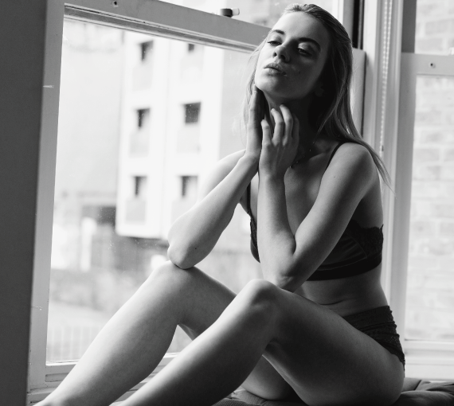

<!-- Main -->

<!-- One -->
<section id="one">
	

		<header class="major">
			<h2>CORPORATE AND CREATIVE HEADSHOTS</h2>
		</header>
		

      I am a creative photographer and I love playing with colours and lights in
      photography.  I will allways create a unique atmosphere and catch your "je ne
      sais quoi" to bring out your best self onto my camera.
    

	

</section>

<!-- Two -->
<section id="two" class="spotlights">
	<section>
		
		

			

				<header class="major">
					<h3>Basic</h3>
				</header>
				

          Build your own brand and stand out from the crowd on tuesday and wednesday.
        
<h3>£49 | 45 minutes</h3>
				<ul class="actions">
					<li><a href="/#contact" class="button">Contact me</a></li>
				</ul>
			

		

	</section>
	<section>
		
		

			

				<header class="major">
					<h3>Standard</h3>
				</header>
				
Bring your personality in your pictures.
<h3>£99 | 2 hrs</h3>
				<ul class="actions">
					<li><a href="/#contact" class="button">Contact me</a></li>
				</ul>
			

		

	</section>
	<section>
		
		

			

				<header class="major">
					<h3>Premium</h3>
				</header>
				
Made for Models, Actors, Musicians.
<h3>£229 | 3 hrs</h3>
				<ul class="actions">
					<li><a href="/#contact" class="button">Contact me</a></li>
				</ul>
			

		

	</section>
  <section>
    
    

      

        <header class="major">
          <h3>Modeling</h3>
        </header>
        

          Build a Modeling Portfolio.
        
<h3>£159 | 2 hrs 30 mins.</h3>
        <ul class="actions">
          <li><a href="/#contact" class="button">Contact me</a></li>
        </ul>
      

    

  </section>
  <section>
    
    

      

        <header class="major">
          <h3>Event</h3>
        </header>
        
Corporate and party event photography.
<h3>£299</h3>
        <ul class="actions">
          <li><a href="/#contact" class="button">Contact me</a></li>
        </ul>
      

    

  </section>
  <section>
    
    

      

        <header class="major">
          <h3>London wedding</h3>
        </header>
        
Romantic wedding photography.
<h3>£349</h3>
        <ul class="actions">
          <li><a href="/#contact" class="button">Contact me</a></li>
        </ul>
      

    

  </section>
  <section>
    <!--  -->
    <iframe class="image" width="570" height="510" src="https://www.youtube.com/embed/bebP8cNyhCE" frameborder="0" allow="accelerometer; autoplay; encrypted-media; gyroscope; picture-in-picture" allowfullscreen></iframe>
    

      

        <header class="major">
          <h3>Video & Filming</h3>
        </header>
        

          Make your own business stand out from the rest.
        
<h3>£249 | 2 hrs</h3>
        <ul class="actions">
          <li><a href="/#contact" class="button">Contact me</a></li>
        </ul>
      

    

  </section>
</section>

<!-- Three -->
<section id="three">
	

		<header class="major">
			<h2>Why are my customers chosing me ?</h2>
		</header>
    <ul>
      <li>
        I'm reactive, adaptive and efficient. If you call me on morning I will be there in the afternoon and you will get your pictures the day​​ afterward.
      </li>
      <li>
        I work with the latest technology. I bring the best quality in every environment like you have never seen before.
      </li>
      <li>
        I help people feel comfortable to get the best photos of them. High quality editing. I'm used to work in photostudio. My eyes make the difference!
      </li>
    </ul>
		<ul class="actions">
			<li><a href="/#contact" class="button next">Get Started</a></li>
		</ul>
	

</section>

